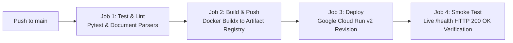

# ADR 0011: Continuous Deployment to Google Cloud Run via GitHub Actions

* **Status**: Accepted
* **Date**: 2026-08-28
* **Deciders**: Engineering Team

## Context

As RFPEngine matures into production, manual deployments via local Docker builds and Terraform CLI commands pose operational risks:
1. **Developer Machine Drift**: Local builds depend on developer environment configurations and credentials.
2. **Lack of Automated Testing Gates**: Deployments could accidentally proceed without running unit test suites and document parser validations.
3. **Auditability & Provenance**: Manual releases lack immutable git SHA tagging, deployment logs, and automated smoke verification.

## Decision

We establish an automated **Continuous Integration & Continuous Deployment (CI/CD)** pipeline using **GitHub Actions** (`.github/workflows/deploy-backend.yml`) targeting **Google Cloud Run**:

### 1. Trigger Strategy
- **Automated Trigger**: Triggers automatically on `git push` to `main` branch when changes are made to `backend/**`, `terraform/**`, or the workflow definition itself.
- **Manual Trigger**: Supports `workflow_dispatch` for on-demand production releases with environment parameterization.

### 2. Pipeline Stages

1. **Job 1: Automated Testing & Validation**:
   - Spawns an isolated `ubuntu-latest` runner with Python 3.11.
   - Installs dependencies and executes document parsing, chunking, and schema validation tests (`pytest tests/test_document_parser.py -v`).
2. **Job 2: Google Cloud Authentication & Artifact Registry Build**:
   - Uses `google-github-actions/auth@v2` with repository secret `GCP_SA_KEY` (`rfpengine-admin@rfpengine.iam.gserviceaccount.com`).
   - Configures Docker credential helper for `us-central1-docker.pkg.dev`.
   - Uses `docker/setup-buildx-action@v3` with GitHub Actions layer caching (`type=gha`) for fast incremental builds.
   - Tags the container with both the immutable git commit SHA (`${{ github.sha }}`) and `latest`.
3. **Job 3: Atomic Cloud Run Deployment**:
   - Deploys the container to the Cloud Run service `rfpengine-api` in `us-central1` using `google-github-actions/deploy-cloudrun@v2`.
   - Cloud Run automatically creates a new immutable revision, routes 100% of live traffic once healthy, and scales down the previous revision.
4. **Job 4: Post-Deployment Health Check Verification**:
   - Executes an automated curl smoke test against `https://rfpengine-api-714049712844.us-central1.run.app/health`.
   - Asserts HTTP 200 OK across Neon PostgreSQL, Elastic Cloud, Pinecone, GCP Secret Manager, and Google Cloud Vertex AI before marking the pipeline as green.

### 3. Required GitHub Repository Secrets
- **`GCP_SA_KEY`**: Complete JSON service account key containing permissions for:
  - Artifact Registry (`roles/artifactregistry.writer`)
  - Cloud Run (`roles/run.admin` & `roles/iam.serviceAccountUser`)
  - Secret Manager (`roles/secretmanager.secretAccessor`)

## Consequences

### Positive
- **Automated Quality Gates**: Broken code or failing tests immediately halt the pipeline before touching production.
- **Zero Downtime Releases**: Cloud Run handles atomic traffic switching between container revisions.
- **Full Traceability**: Every running Cloud Run revision is linked directly to an exact GitHub commit SHA.
- **Fast Build Times**: GitHub Actions layer caching avoids rebuilding unmodified pip dependencies.

### Negative / Trade-offs
- Requires maintaining the `GCP_SA_KEY` secret within GitHub repository settings (or configuring Workload Identity Federation).
