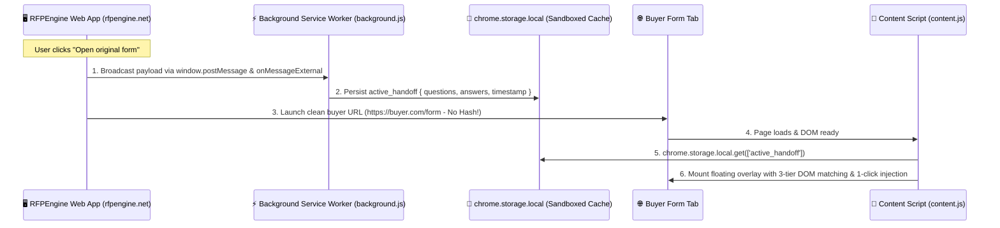

# ADR 0013: Manifest V3 Background Service Worker IPC and Sandboxed Storage Sync

* **Status**: Accepted
* **Date**: 2026-08-28
* **Deciders**: Engineering & Product Team

## Context

In early iterations of RFPEngine, pre-approved questionnaire answers were transferred from the web application workspace to external buyer procurement forms (e.g. `mock-questionnaire.html` or Coupa/Ariba portals) by encoding the payload into the URL hash fragment (`#rfpengine={"questions":[...],"answers":{...}}`).

While this approach provided zero-configuration handoff across origins without session pairing, it introduced several critical production limitations:
1. **Browser URL Length Limits**: Complex enterprise RFPs contain 50–100+ questions with multi-paragraph narrative answers. Encoding these payloads exceeded browser address bar limits (typically 2,048 characters in legacy browsers and ~32 KB in Chromium), resulting in truncated or dropped responses.
2. **Cluttered Address Bar**: Encoding massive URL-escaped strings degraded user experience and looked unpolished.
3. **Data Exposure in History**: URL hash fragments persist in local browser navigation history and clipboard operations, posing data exposure risks for sensitive compliance commitments.

## Decision

We replace URL fragment parameterization with a high-speed, secure **Inter-Process Communication (IPC)** architecture utilizing the **Manifest V3 Background Service Worker** and **`chrome.storage.local`**:

### Key Components:

1. **Manifest Permissions & External Connectability (`manifest.json`)**:
   - Configured `"permissions": ["sidePanel", "activeTab", "tabs", "storage"]`.
   - Added `"externally_connectable"` for `https://www.rfpengine.net/*` and `http://localhost:*/*`.
2. **Background Service Worker Hub (`background.js`)**:
   - Operates as the central state and event hub listening for both external messages (`chrome.runtime.onMessageExternal`) and internal extension messages (`chrome.runtime.onMessage`).
   - Persists active handoff packages to sandboxed `chrome.storage.local`.
3. **Dual-Channel Synchronization (`content.js` & `App.tsx`)**:
   - When the user launches a form, `App.tsx` dispatches `window.postMessage({ type: 'RFPENGINE_SYNC_ANSWERS', questions, answers })`.
   - Content script on the web app forwards the payload to the Service Worker and caches it locally.
4. **3-Tier Robust Field Matching Heuristic**:
   - **Tier 1 (Exact)**: Matches by complete label text, `aria-labelledby`, or `aria-label`.
   - **Tier 2 (Fuzzy Semantic)**: Computes word-overlap similarity ($\ge 0.20$) to accommodate trailing asterisks (`*`) or slight phrasing discrepancies.
   - **Tier 3 (Positional Sequential Fallback)**: Automatically pairs field $i$ with answer $i$ from the workspace if field labels are dynamically obfuscated or omitted.

## Consequences

### Positive
- **100% Clean URLs**: Buyer form tabs open with pristine URLs without any messy hash parameters in the address bar.
- **Unlimited Payload Capacity**: Removes URL character limits entirely, allowing massive multi-sheet RFPs to transfer instantly.
- **Enhanced Privacy & Security**: Approved answers remain inside sandboxed extension memory and are never persisted to browser navigation history.
- **Zero LLM API Latency**: The extension detects the pre-approved workspace payload and performs 1-click batch injection without redundant AI API calls.

### Negative / Trade-offs
- Requires the Chrome extension to be installed and active in the user's browser (a backward-compatible URL hash fallback is retained if the extension is not detected).

