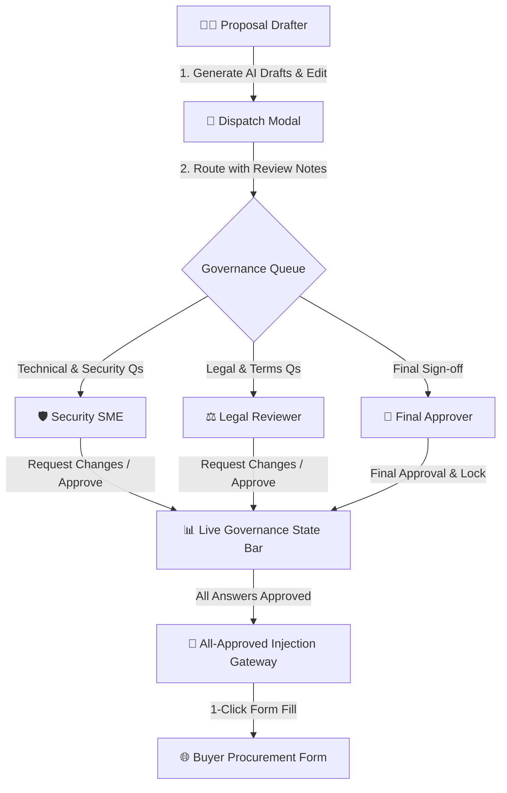

# ADR 0014: Four-Role Enterprise Governance and SME Review Queue

* **Status**: Accepted
* **Date**: 2026-08-28
* **Deciders**: Engineering & Product Team

## Context

Enterprise sales deals, security questionnaires, and formal RFPs represent legally binding commitments regarding encryption architectures, SLA uptime, data retention, and compliance standards (SOC 2, ISO 27001, GDPR). 

Allowing a single user or unverified AI output to directly populate buyer forms creates unacceptable corporate liability risks:
1. **Lack of Separation of Duties**: Proposal writers are often sales generalists who lack the technical authority to commit to specific SLA warranties or disaster recovery recovery-point objectives (RPO).
2. **Missing Review Feedback Loop**: When an answer needs revision, there was no structured mechanism for subject matter experts (SMEs) or legal counsel to record inline change requests.
3. **No Gatekeeping for Form Submission**: Incomplete or draft responses could inadvertently be submitted to external buyer portals before receiving necessary approvals.

## Decision

We designed and implemented a comprehensive **4-Role Enterprise Governance & Review Queue** within the core workspace:

### Key Architectural Pillars:

1. **Four Distinct Governance Roles**:
   - **🧑‍💻 Proposal Drafter**: Ingests questionnaires, generates initial AI drafts grounded in verified knowledge, and coordinates the bid.
   - **🛡️ Security SME**: Reviews technical architecture, encryption parameters, SOC 2 alignment, and SLA commitments.
   - **⚖️ Legal Reviewer**: Audits compliance obligations, data privacy policies, liabilities, and contractual warranties.
   - **👑 Final Approver**: Performs executive sign-off and locks answers for submission.
2. **Interactive Dispatch Drawer / Modal (`openSendForReviewModal`)**:
   - Enables drafters to route single questions or entire questionnaires to specific target roles.
   - Allows attaching structured review instructions (e.g. *"Please verify 35-day backup retention matches current SOC 2 report"*).
3. **Role-Aware Status Classification**:
   - `DRAFT READY`: Initial AI generation complete, pending drafter review.
   - `SME REVIEW`: Dispatched to Technical/Security team.
   - `LEGAL REVIEW`: Dispatched to Legal counsel.
   - `CHANGES REQUESTED`: Reviewer left actionable feedback notes.
   - `APPROVED BY SME` / `APPROVED BY LEGAL`: Stamped with domain-level approval.
   - `FINAL APPROVED`: Fully unlocked for submission.
4. **Interactive Change Request Loop**:
   - Reviewers can click **"Request changes"** to record inline feedback callouts (`reviewCommentsByQuestion`), updating status and prompting the drafter to revise.
5. **Celebratory All-Approved Gateway**:
   - The primary **"⚡ Inject Answers into Buyer Form"** action unlocks only when all questions achieve certified approval, preventing premature or unauthorized submissions.

## Consequences

### Positive
- **Guaranteed Submission Safety**: Eliminates the risk of submitting unverified or hallucinated draft answers to customer procurement portals.
- **Clear Audit Trail**: Every answer maintains visible status history and reviewer feedback.
- **Role Separation**: Empowers cross-functional teams (Sales + Security + Legal) to collaborate efficiently in a single unified workspace.

### Negative / Trade-offs
- Adds a structured workflow step before submission, requiring design and testing partner validation to maintain high deal velocity.

