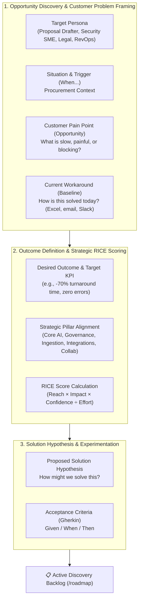

# ADR 0015: Continuous Discovery and Opportunity-First Product Framing

* **Status**: Accepted
* **Date**: 2026-08-29
* **Deciders**: Product & Engineering Team

## Context

In standard product management and software intake, collecting raw "feature requests" creates well-documented anti-patterns:
1. **Solution-First Bias / The XY Problem**: Stakeholders request a specific UI button or technical implementation without articulating the underlying customer friction or root cause.
2. **Missing Workaround Baselines**: Without understanding how users solve the problem today, product teams cannot evaluate the switching cost or baseline value of a proposed capability.
3. **Unclear Success Criteria**: Feature requests rarely define what measurable outcome proves the investment succeeded.

To establish senior-level product discovery discipline, RFPEngine requires an industry-standard product intake and discovery methodology.

## Decision

We adopt **Teresa Torres' Continuous Discovery & Opportunity Solution Tree (OST)** framework combined with **Jobs-to-be-Done (JTBD)** for all discovery intake on the `/roadmap` hub:

### Discovery Intake Schema:

| Framework Field | Continuous Discovery Purpose | Example |
| :--- | :--- | :--- |
| **Opportunity / Problem Title** | High-level summary of the customer friction | *Automated Tabular Spreadsheet Parser for 300-Row CAIQ Portals* |
| **Target User Persona** | Identifies the primary stakeholder | `Proposal Manager`, `Security SME`, `Legal Counsel`, `RevOps` |
| **Situation & Trigger (When...)** | Contextual trigger in the deal cycle | *When a buyer sends a 300-row Excel sheet with merged column headers...* |
| **Current Workaround (Baseline)** | Uncovers switching costs & baseline friction | *Today, bid teams manually copy questions into Google Docs and email 4 SMEs.* |
| **Desired Outcome & KPI** | Measurable value definition | *Reduce questionnaire completion time from 3 days to < 2 hours with 0 errors.* |
| **Strategic Pillar & Theme** | Portfolio alignment | `Smart Ingestion`, `Enterprise Governance`, `Core AI` |
| **Solution Hypothesis** | Testable product hypothesis | *A WebAssembly client parser with column heuristics and 1-click round-trip export.* |

## Industry Precedent & Real-World Adoption

This Opportunity-First Discovery methodology is utilized by world-class product organizations:
* **Spotify**: Standardizes product discovery across autonomous squads using Teresa Torres' Opportunity Solution Trees.
* **Atlassian (Jira Product Discovery)** & **Productboard**: Built their entire discovery data models around Customer Opportunities and Pain Points rather than raw feature tickets.
* **Linear & Stripe**: Mandate problem framing, customer evidence, and workaround analysis before greenlighting product specs.
* **GitLab**: Documents Opportunity Solution Trees directly in their public Product Management Handbook.

## Consequences

### Positive
- **Guarantees Problem-Solution Fit**: Validates customer pain and baseline workarounds before writing code.
- **Data-Driven Prioritization**: Enables objective RICE scoring grounded in validated reach and impact metrics.
- **Consistent PRD Generation**: Automatically structures discovery submissions into actionable Agile User Stories and Acceptance Criteria.

### Negative / Trade-offs
- Requires slightly more structured input from contributors compared to a basic one-line feature request form.
