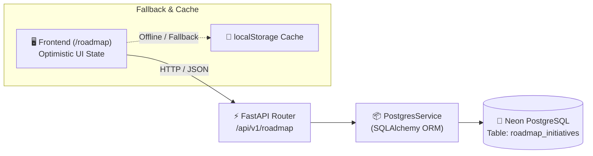

# ADR 0016: Relational Persistence for Product Roadmap and Discovery Backlog

* **Status**: Accepted
* **Date**: 2026-08-30
* **Deciders**: Product & Engineering Team

## Context

The in-app Product Discovery and RICE Prioritization Roadmap Hub (`/roadmap`) initially persisted initiative state, drag-and-drop stage movements, upvotes, and customer opportunity submissions in client-side `localStorage`.

While `localStorage` offered immediate responsiveness and zero-latency prototyping, it presented critical enterprise collaboration limitations:
1. **Siloed State**: Feature submissions and upvotes made by one user (e.g. a Security SME or Bid Manager) were invisible to other team members on different machines.
2. **No Multi-Tenant Isolation**: Enterprise accounts require scoped roadmaps where internal product backlog items are partitioned by tenant ID.
3. **Risk of Cache Loss**: Clearing browser data or using private browsing wiped out custom-submitted opportunities and vote counts.

## Decision

We establish centralized relational persistence for the Product Roadmap Hub using **PostgreSQL** (`roadmap_initiatives` table) with FastAPI REST endpoints (`/api/v1/roadmap`) and resilient optimistic frontend caching:

### Key Architectural Components:

1. **Relational Database Model (`roadmap_initiatives`)**:
   - Maps full initiative metadata: `id`, `tenant_id`, `title`, `stage`, `theme`, `priority`, `target_persona`, `quarter`, `summary`, `problem_statement`, `user_story`, `success_metrics` (JSON), `acceptance_criteria` (JSON), `technical_architecture`, `rice_reach`, `rice_impact`, `rice_confidence`, `rice_effort`, `rice_score`, `upvotes`, and `tags` (JSON).
2. **Auto-Seeding Mechanism**:
   - On initial query, if a tenant's roadmap table is empty, the backend automatically seeds the canonical 11 baseline initiatives.
3. **RESTful Lifecycle Endpoints (`/api/v1/roadmap`)**:
   - `GET /api/v1/roadmap`: Retrieves tenant initiatives with stage and theme filtering.
   - `POST /api/v1/roadmap`: Ingests continuous discovery opportunities.
   - `PATCH /api/v1/roadmap/{id}`: Updates stage on tactile drag-and-drop transitions.
   - `POST /api/v1/roadmap/{id}/upvote`: Executes atomic upvote/downvote increments.
   - `POST /api/v1/roadmap/reset`: Restores the default roadmap backlog on demand.
4. **Optimistic Client Synchronization**:
   - The React client applies UI changes immediately (drag-and-drop moves, upvote badge updates) while sending background async PATCH/POST requests, falling back to `localStorage` if network connectivity is interrupted.

## Consequences

### Positive
- **Collaborative Discovery**: Entire bid teams, SMEs, and sales leadership share a synchronized view of active sprints, discovery opportunities, and upvotes.
- **Enterprise Multi-Tenancy**: Data is securely partitioned by `tenant_id`.
- **Zero-Downtime Resilience**: Optimistic frontend updates guarantee instant UI feedback regardless of backend latency.

### Negative / Trade-offs
- Adds database write overhead for stage drag-and-drop movements, mitigated by indexed primary keys and lightweight payload patches.
