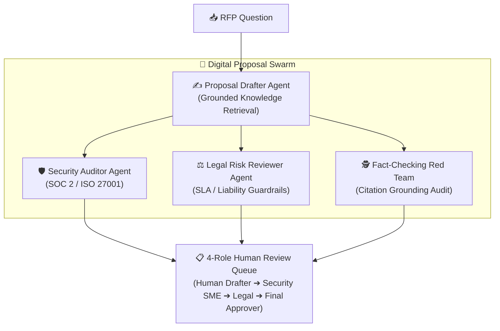

# ADR 0017: Specialized AI Proposal Drafter and Multi-Agent Swarm Evolution

* **Status**: Accepted
* **Date**: 2026-08-30
* **Deciders**: Product & Engineering Team

## Context

Previously, RFPEngine referred to its core inference and retrieval capability generically as "AI Suggestion", "AI Assistant", or "Grounded Search".

While functional, this monolithic framing presented several product and architectural limitations:
1. **Generic Perception**: Abstract "AI" terminology obscured the specific grounded retrieval, document chunking, and confidence scoring work being performed.
2. **Disconnected Governance Alignment**: Our 4-role enterprise governance model (ADR 0014) established explicit human stakeholder roles (`Proposal Drafter`, `Security SME`, `Legal Reviewer`, `Final Approver`). The AI capability lacked a symmetric identity as a digital teammate.
3. **Impediment to Swarm Expansion**: Moving from single-shot retrieval to a multi-agent federation (e.g. adding an Adversarial Fact-Checker, Security Auditor, and Legal Reviewer) required redefining the AI from a single tool into an extensible digital bid team.

## Decision

We formally rename and establish the baseline AI retrieval engine as the **"Proposal Drafter"** (`Proposal Drafter Agent`). 

Furthermore, we define the roadmap architecture for the **AI Proposal Swarm**, where specialized digital agents collaborate in parallel to mirror human SME governance:

### Key Architectural Updates:

1. **Unified Role Terminology**:
   - The primary grounded generation action across the Seller Workspace and Chrome Extension is designated as **"Draft with Proposal Drafter"**.
   - Output cards and inspection drawers explicitly badge drafts with **"✍️ Proposal Drafter"** and confidence metrics.
2. **Digital Bid Team Evolution on `/roadmap`**:
   - The foundational Cloud Run Vertex AI capability is indexed as the **Proposal Drafter Agent**.
   - Specialized peer agents are formally scoped into the discovery backlog:
     - **Security & Compliance Auditor Agent**: Scans answers against SOC 2, ISO 27001, and pen test reports.
     - **Legal Risk & SLA Reviewer Agent**: Evaluates liability caps, indemnification, and uptime warranties.
     - **Adversarial Fact-Checking Red Team Agent**: Performs sentence-level citation verification to eliminate hallucinations.

## Consequences

### Positive
- **Human-Centric Mental Model**: Digital agents map directly to enterprise bid workflows as augmented co-workers.
- **Explainable Provenance**: Users clearly see which specialized agent produced an answer, why, and from what verified documents.
- **Architectural Modularity**: Paves the way for plug-and-play agent swarms without disrupting existing response endpoints.
