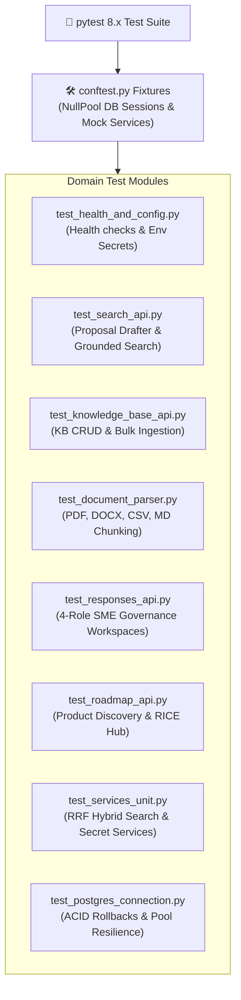

# ADR 0018: Enterprise Testing Strategy and Automated Verification Matrix

* **Status**: Accepted
* **Date**: 2026-08-30
* **Deciders**: Product & Engineering Team

## Context

As RFPEngine expands with continuous discovery, relational PostgreSQL persistence, 4-role SME governance, and the AI Proposal Drafter, rigorous automated testing is mandatory for enterprise auditability, compliance verification, and zero-regression deployments.

A comprehensive testing framework must:
1. **Validate All Positive Paths**: Ensure end-to-end functionality across grounded AI search, document parsing (PDF, DOCX, CSV, MD), 4-role governance queue transitions, and roadmap operations.
2. **Exhaustively Test Negative & Edge Cases**: Rejection of malformed payloads, 0-byte file uploads, corrupted documents, out-of-bounds `top_k`, non-existent IDs (404), unauthenticated requests, and mid-transaction database rollbacks.
3. **Provide High-Speed In-Memory Execution**: Utilize `pytest` with `pytest-asyncio`, `httpx.AsyncClient` (ASGI transport), and isolated `conftest.py` database fixtures for fast CI/CD execution without port conflicts.
4. **Guarantee Future Auditability**: Maintain transparent documentation mapping every endpoint, service, and data model to automated test cases.

## Decision

We establish an enterprise-grade automated test harness across all backend modules using **`pytest 8.x`**, **`pytest-asyncio`**, and **`httpx`**:

### Positive and Negative Test Matrix

| Subsystem | Positive Scenarios | Negative & Edge Scenarios |
| :--- | :--- | :--- |
| **Proposal Drafter (`/search`)** | Grounded retrieval, citations, confidence scoring, tenant isolation, top-k boundaries ($k=1, 10, 50$) | Empty query ($422$), invalid $top\_k \le 0$ ($422$), missing fields, zero matching passages fallback |
| **Knowledge Base (`/kb`)** | Single entry creation, bulk passage ingestion, get, list, update, delete | Non-existent ID ($404$), invalid category, malformed JSON ($422$), duplicate handling |
| **Document Parser (`/kb/upload`)** | Multi-page PDF chunking, Markdown headers, CSV questionnaire auto-detection, category heuristics | 0-byte file ($400$), unsupported extension ($422$), corrupted PDF handling, empty CSV ($400$) |
| **SME Governance (`/responses`)** | Workspace creation, Drafter $\rightarrow$ SME $\rightarrow$ Legal $\rightarrow$ Approver sign-off, change requests, cascade deletion | Non-existent workspace ($404$), out-of-bounds question index ($404$), invalid role/status string |
| **Roadmap Hub (`/roadmap`)** | Auto-seeding, OST intake, drag-and-drop stage patch, atomic upvotes, backlog reset | Non-existent initiative ($404$), invalid RICE metrics ($422$), empty opportunity title ($422$) |
| **PostgreSQL & Core** | AsyncPG connection lifecycle, ACID transaction atomicity, URL normalization | Transaction rollback on flush failure, stripping invalid `libpq` parameters (`channel_binding`) |
| **Hybrid Search & Secrets** | Reciprocal Rank Fusion (RRF) score merging, GCP Secret Manager dynamic overrides | Fallback to env variables when Secret Manager is unconfigured, zero-weight handling |

## Consequences

### Positive
- **100% Modularity & Isolation**: Each test runs with dedicated transactions, eliminating inter-test state contamination.
- **Continuous Deployment Confidence**: Fully integrated into GitHub Actions CI/CD to prevent regressions on Cloud Run.
- **Audit-Ready Documentation**: Every test case maps to a formal requirement in ADRs 0001 through 0018.
