# ADR 0019: Closed-Loop AI Feedback Architecture: Golden Q&A Promotion, Edit Drift Analytics, and In-Context Exemplar Learning

* **Status**: Accepted
* **Date**: 2026-08-30
* **Deciders**: Product & Engineering Team

## Context

In enterprise proposal management, initial AI-generated drafts are frequently refined and approved by domain experts (**Proposal Drafters**, **Security SMEs**, **Legal Counsel**, and **Final Approvers** per ADR 0014).

However, in a one-directional retrieval architecture:
1. **Knowledge Silos**: Human edits and corrections remain trapped inside individual RFP workspaces.
2. **Repetitive Work**: SMEs repeatedly rewrite the same compliance answers across different customer questionnaires.
3. **Invisible Knowledge Drift**: Outdated documentation passages in the vector store continue to generate suboptimal drafts without notifying Knowledge Managers.

To solve this, RFPEngine requires a **Closed-Loop AI Feedback Architecture** that transforms one-off SME approvals into reusable institutional knowledge and telemetry.

## Decision

We establish an enterprise **Closed-Loop Feedback Architecture** organized into 3 modular levels:

```mermaid
flowchart TD
    subgraph L1 ["⭐ Level 1: Curated Golden Q&A Promotion"]
        A1["SME Approves Question"] --> B1["1-Click 'Promote to Knowledge Base'"]
        B1 --> C1["Indexed into PostgreSQL + ES + Pinecone<br/>(Category: 'Golden Q&A')"]
    end

    subgraph L2 ["📊 Level 2: Edit Drift & Stale Doc Detection"]
        A2["Diff: suggested_answer vs final_answer"] --> B2["Calculate Levenshtein / Semantic Drift"]
        B2 --> C2["Alert Knowledge Manager of Stale Policy Chunks"]
    end

    subgraph L3 ["🧠 Level 3: Dynamic Few-Shot In-Context Learning"]
        A3["Incoming RFP Question"] --> B3["Retrieve Raw Docs + Top-2 Golden Q&A Exemplars"]
        B3 --> C3["Gemini 2.5 Flash Mimics Company Pitch Tone"]
    end
```



### Architectural Specifications:

#### 1. Level 1: Curated Golden Q&A Promotion (`FEAT-FEEDBACK-L1`)
- **Mechanism**: Adds a `[ ⭐ Promote to Knowledge Base ]` action on approved question cards (`review_status == "Approved"`).
- **Governance Gate**: Promotion is restricted to verified roles (`Security SME`, `Legal Counsel`, `Approver`) to prevent unverified text contamination.
- **Index Synchronization**: Creates a `KBEntry` tagged `category: "Golden Q&A"` with provenance metadata (`origin_workspace_id`, `approved_by_role`, `approval_timestamp`), immediately updating PostgreSQL, Elasticsearch (BM25), and Pinecone (768-dim embeddings).

#### 2. Level 2: Edit Distance & Stale Document Detector (`FEAT-FEEDBACK-L2`)
- **Mechanism**: Background telemetry evaluates the similarity ratio between `suggested_answer` (AI) and `final_answer` (Human).
- **Staleness Heuristic**: When a specific source document passage triggers $>50\%$ human rewrite frequency across 5+ RFPs, it flags a `⚠️ Stale Documentation Alert` in the Knowledge Hub for proactive maintenance.

#### 3. Level 3: Dynamic Few-Shot In-Context Exemplar Learning (`FEAT-FEEDBACK-L3`)
- **Mechanism**: Enhances `HybridSearchService` to retrieve both raw document chunks and top-2 historical `Golden Q&A` pairs from the same tenant.
- **Prompt Conditioning**: Injects winning Q&A pairs as dynamic few-shot exemplars inside the Gemini 2.5 Flash system prompt, teaching the AI to mirror company tone, brevity, and markdown styling without costly weight fine-tuning.

## Data Model Extensions

```sql
-- Knowledge Base Entry Provenance
ALTER TABLE kb_entries 
ADD COLUMN IF NOT EXISTS origin_workspace_id VARCHAR(100),
ADD COLUMN IF NOT EXISTS approved_by_role VARCHAR(50),
ADD COLUMN IF NOT EXISTS is_golden_qa BOOLEAN DEFAULT FALSE;

-- Response Quality Telemetry
CREATE TABLE IF NOT EXISTS response_feedback_telemetry (
    id VARCHAR(100) PRIMARY KEY,
    workspace_id VARCHAR(100) REFERENCES response_workspaces(id) ON DELETE CASCADE,
    question_index INT NOT NULL,
    suggested_answer TEXT NOT NULL,
    final_answer TEXT NOT NULL,
    edit_distance_ratio FLOAT NOT NULL,
    reviewer_role VARCHAR(50) NOT NULL,
    created_at TIMESTAMP WITH TIME ZONE DEFAULT CURRENT_TIMESTAMP
);
```

## Consequences

### Positive
- **Continuous Intelligence Flywheel**: Every completed proposal makes future retrieval smarter and more aligned with company voice.
- **Zero Hallucination Contamination**: Human-in-the-loop approval gates ensure only verified SME outputs enter the canonical knowledge index.
- **Proactive Maintenance**: Replaces reactive discovery of outdated documentation with automated drift alerts.

### Negative / Mitigation
- **Index Duplication Risk**: Excessive promotions of near-duplicate questions could clutter vector search.
  - *Mitigation*: Vector deduplication check during promotion prevents duplicate Q&A indexing within a $0.95$ cosine similarity threshold.
