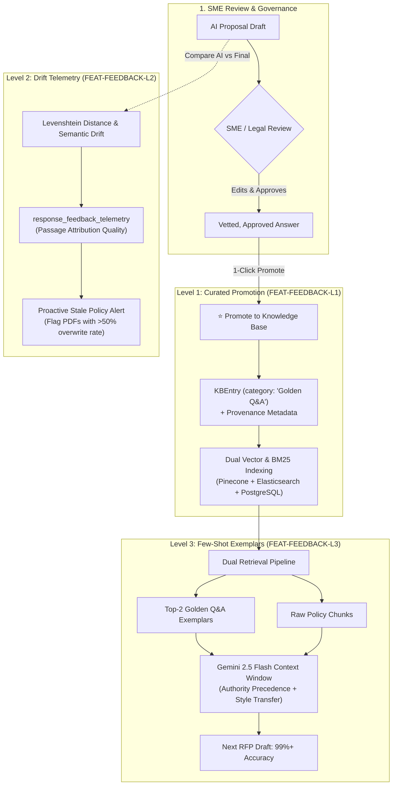

# ADR 0019: Closed-Loop AI Feedback Architecture & Continuous Learning Loop

* **Status**: Accepted
* **Date**: 2026-08-30
* **Deciders**: Product & Engineering Team
* **Related Issues / PRDs**: `EPIC-AI-FEEDBACK-LOOP`, `FEAT-FEEDBACK-L1`, `FEAT-FEEDBACK-L2`, `FEAT-FEEDBACK-L3`

---

## Context

In traditional enterprise RAG (Retrieval-Augmented Generation) architectures, AI responses are generated by retrieving static passages from uploaded company documents (PDFs, Word docs, wikis). However, this creates a **disconnected, one-way workflow**:

1. **Repetitive SME Overhead**: Security and Legal SMEs spend hours each week repeatedly correcting the exact same standard compliance questions (e.g., encryption ciphers, SOC 2 cadences, SLA commitments) across different customer RFPs because edits remain trapped in individual proposal workspaces.
2. **Stale Collateral Blindness**: As company policies and certifications evolve, knowledge managers have zero automated visibility into which uploaded PDFs contain obsolete clauses until an SME flags a discrepancy during a live bid.
3. **Tone & Style Inconsistency**: Raw RAG synthesizes factual chunks but often produces generic, robotic prose that lacks the persuasive tone and structure of winning past proposals.
4. **Prohibitive Fine-Tuning Costs**: Traditional fine-tuning of foundational LLMs is slow, expensive, prone to catastrophic forgetting, and difficult to rollback.

To solve this, RFPEngine requires an **active Closed-Loop AI Feedback Architecture** that learns continuously from human SME edits and approvals without expensive model fine-tuning.

---

## Decision

We establish a **3-Tier Closed-Loop AI Feedback Architecture** that captures human-in-the-loop signal at every stage of the proposal lifecycle:



---

## The 3 Feedback Loop Levels

### Level 1: Curated Golden Q&A Promotion & 1-Click Sync (`FEAT-FEEDBACK-L1`)
* **Objective**: Enable Security SMEs and Legal Reviewers to promote verified, approved answers directly into the canonical knowledge base with one click.
* **Mechanism**:
  1. Once a question reaches status `Approved` in the review queue, an interactive `[ ⭐ Promote to KB ]` action appears.
  2. Invokes `POST /api/v1/workspaces/{workspace_id}/questions/{question_index}/promote`.
  3. Creates or updates a `KBEntry` under `category: "Golden Q&A"` with provenance metadata (`origin_workspace_id`, `approved_by_role`, `is_golden_qa: true`, `promoted_at`).
  4. Synchronizes dense embeddings (768-dim) into Pinecone and BM25 index in Elasticsearch.
  5. Renders a persistent `⭐ Promoted to Knowledge Base` audit badge on the question card.

### Level 2: Edit-Distance Telemetry & Stale Document Drift Detector (`FEAT-FEEDBACK-L2`)
* **Objective**: Automatically measure how much human SMEs modify AI drafts and flag stale company collateral.
* **Mechanism**:
  1. Computes the character/token edit distance (Levenshtein ratio and semantic embedding similarity) between the initial AI suggested draft and the final submitted answer.
  2. Logs feedback telemetry into PostgreSQL (`response_feedback_telemetry`).
  3. Aggregates passage attribution quality: if a specific uploaded PDF passage is consistently overwritten (>50% edit distance across 5+ proposals), the Knowledge Hub triggers a **Stale Policy Alert** notifying knowledge managers to upload updated collateral.

### Level 3: Dynamic Few-Shot In-Context Learning from Exemplars (`FEAT-FEEDBACK-L3`)
* **Objective**: Teach Gemini 2.5 Flash company-specific pitch tone and formatting without fine-tuning weights.
* **Mechanism**:
  1. When querying `/search`, the retrieval orchestrator pulls both raw document chunks and the top-2 closest approved **Golden Q&A Exemplars**.
  2. Dynamically formats the prompt with few-shot demonstration pairs:
     ```text
     [PROVEN COMPANY EXEMPLAR - SECURITY SME APPROVED]
     Question: "What encryption standards are enforced?"
     Answer: "Strictly TLS 1.3 with AES-256-GCM across all customer endpoints. TLS 1.2 is deprecated."
     ```
  3. Gemini 2.5 Flash adapts its synthesis to match the exact brevity, tone, and rigor of past winning responses.

---

## Authority Precedence & Guardrails

To prevent Level 1 from simply being "another chunk in the vector store", two core architectural guardrails are enforced:

1. **RRF Authority Rank Boosting**:
   * Any passage matching `category: "Golden Q&A"` or `is_golden_qa: true` receives a **$1.5\times$ to $2.0\times$ score multiplier** during Reciprocal Rank Fusion (RRF).
   * **Guarantee**: SME-approved answers will always rank at position #1 over raw PDF chunks for recurring questions.

2. **System Prompt Hierarchy**:
   * Gemini 2.5 Flash prompt explicitly instructs:
     > *"Retrieved sources include both General Policy Documents and SME-Approved Golden Q&As (`is_golden_qa: true`). Golden Q&As represent verified human sign-offs; treat them with highest authority and override any conflicting statements in older policy files."*

3. **Customer-Specific Contamination Protection**:
   * Promotion sanitizes prospect-specific deal terms (e.g., custom SLA numbers or buyer names) before canonical insertion to prevent cross-customer data leakage.

---

## Data Model & Schema Additions

### 1. `question_reviews` (PostgreSQL)
```python
is_promoted_to_kb: Mapped[bool] = mapped_column(Boolean, default=False)
promoted_kb_id: Mapped[Optional[str]] = mapped_column(String(64), nullable=True)
```

### 2. `kb_entries` Metadata Payload
```json
{
  "category": "Golden Q&A",
  "metadata": {
    "is_golden_qa": true,
    "origin_workspace_id": "ws-2026-security-rfp",
    "origin_question_index": 0,
    "approved_by_role": "Security SME",
    "promoted_at": "2026-08-30T11:30:00Z"
  }
}
```

---

## Consequences & Trade-offs

### Positive
* **Immediate Zero-Cost Learning**: The system improves immediately after every proposal without multi-week model retraining cycles.
* **Elimination of SME Fatigue**: Solves the recurring questionnaire problem by reusing vetted compliance language.
* **Complete Auditability & Provenance**: Every promoted answer traces back to who approved it, which client RFP it originated from, and when.
* **Automated Knowledge Maintenance**: Level 2 telemetry alerts admins to stale policies before proposals are sent to buyers.

### Considerations & Mitigations
* **Knowledge Base Growth**: Over time, hundreds of Golden Q&As may be promoted. Level 2 drift analytics and deduplication filters ensure obsolete entries are superseded.
* **Role-Based Promotion Permissions**: Only verified roles (`Security SME`, `Legal reviewer`, `Final approver`) are permitted to promote entries to canonical status.
