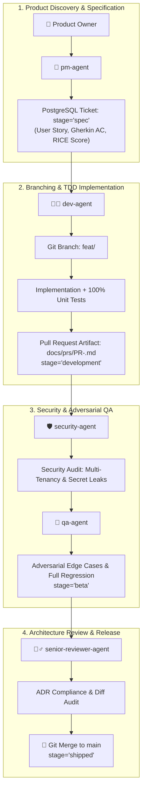

# ADR 0020: Autonomous 5-Agent SDLC Governance & Branching Architecture

* **Status**: Accepted
* **Date**: 2026-08-30
* **Deciders**: Product & Engineering Team
* **Related Issues**: `FEAT-AGENTIC-SDLC-GOVERNANCE`

---

## Context

As AI coding agents assume primary development execution in RFPEngine, relying on a single monolithic agent creates critical failure modes:
1. **Confirmation Bias**: An agent that writes code is predisposed to write naive tests that confirm its own assumptions.
2. **Security Blindspots**: Without a dedicated security audit gate, subtle multi-tenant data leaks, credential disclosures, or unescaped prompt injections can bypass review.
3. **Direct-to-Main Regressions**: Pushing directly to `main` without isolated branch lifecycles and PR artifacts prevents proper auditability and rollbacks.
4. **Lack of Traceable Governance**: Enterprise customers require demonstrable proof that changes pass formal acceptance criteria, adversarial QA, and architectural reviews before production deployment.

---

## Decision

We establish an **Autonomous 5-Agent SDLC Governance Framework** where specialized subagents execute distinct roles across an isolated git branch workflow, with the in-app PostgreSQL Roadmap Kanban serving as the single source of truth for ticket lifecycles.

---

## The 5 Subagent Roles & Responsibilities

| Subagent | Persona | Responsibilities | Target Stage |
| :--- | :--- | :--- | :--- |
| **`pm-agent`** | Product Manager | Frames user stories, Gherkin acceptance criteria, RICE metrics | `discovery` $\rightarrow$ `spec` |
| **`dev-agent`** | Senior Developer | Branch creation, TDD implementation, PR documentation | `spec` $\rightarrow$ `development` |
| **`security-agent`** | Security Auditor | Multi-tenant isolation checks, secret sanitization, prompt injection defenses | Security Sign-off |
| **`qa-agent`** | QA Engineer | Adversarial boundary testing (400/404/422), regression suites, live DB checks | `development` $\rightarrow$ `beta` |
| **`senior-reviewer-agent`** | Principal Architect | ADR verification, diff audit, git merge to `main`, documentation updates | `beta` $\rightarrow$ `shipped` |

---

## Git Branching & Ticket Lifecycle Rules

1. **Branch Naming Standard**:
   `feat/<ticket-id>-<slug>`, `fix/<ticket-id>-<slug>`, or `chore/<ticket-id>-<slug>`.
2. **No Direct Pushes to `main`**:
   All new features and fixes must originate on an isolated branch and be merged only via `senior-reviewer-agent` approval.
3. **Canonical State in PostgreSQL**:
   The `roadmap_initiatives` table in PostgreSQL tracks the state transition:
   $$\text{discovery} \longrightarrow \text{spec} \longrightarrow \text{development} \longrightarrow \text{beta} \longrightarrow \text{shipped}$$
4. **Mandatory Sign-offs**:
   A PR cannot merge to `main` without both `security-agent` and `qa-agent` approval stamps.

---

## Consequences & Trade-offs

### Positive
* **Zero Self-Approvals**: Separates builder, adversary, security auditor, and release gatekeeper.
* **100% Auditability**: Every merge has an associated ticket in PostgreSQL, a dedicated branch, and QA + Security audit reports.
* **Deterministic Quality**: No regressions reach `main` without passing full 60+ test suites.

### Considerations
* Requires disciplined multi-step orchestration. Automated with `Taskfile` and subagent definitions.

