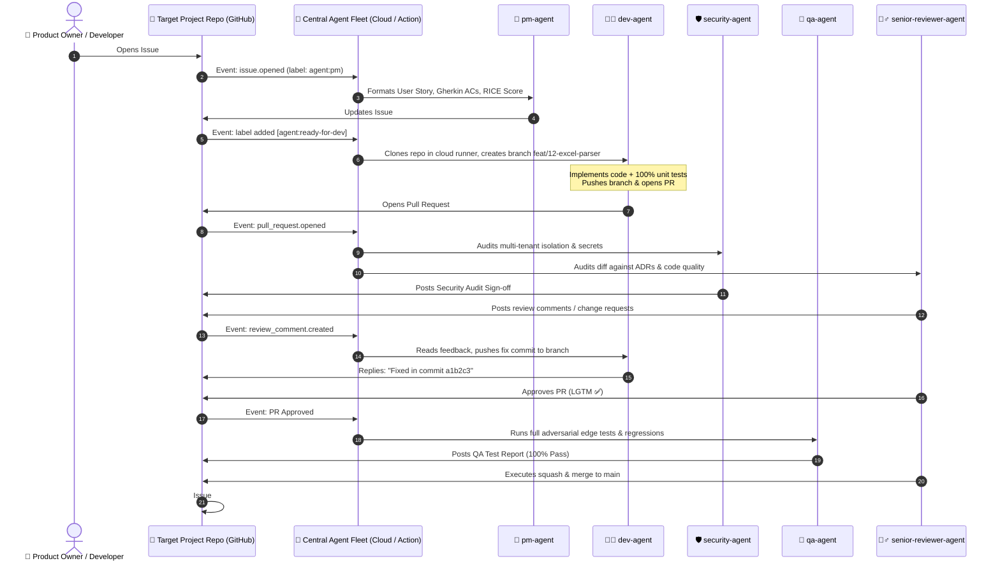

# Blueprint: Centralized GitHub-Native Agentic SDLC

* **Type**: Architecture Design Blueprint & Future Implementation Guide
* **Date**: 2026-08-30
* **Status**: Proposed / Blueprint for Future Implementation
* **Scope**: Cross-Repository Multi-Agent Software Development Lifecycle

---

## 1. Executive Summary & Vision

Traditional AI-assisted coding places the agent directly on the developer's workstation or within an individual application repository. This creates severe limitations:
1. **Lack of Portability**: Prompts, tools, and workflows must be copied into every new repository.
2. **Local Machine Dependency**: Requires local tool installations, virtual environments, and active terminal sessions.
3. **Confirmation Bias**: A single developer agent writing both code and tests rubber-stamps its own assumptions.

### The Centralized Vision
We decouple the **Agent Fleet** into a **Centralized Agent Repository / Service** (`agentic-sdlc-central`). Target repositories (e.g., `RFPEngine`, `Project-B`, `Microservice-C`) contain **only application code**. All agent planning, development, security auditing, adversarial QA, and code review occur asynchronously on **GitHub Issues & Pull Requests**.

---

## 2. End-to-End Workflow & Event Lifecycle



---

## 3. The 5 Specialized Autonomous Subagents

All subagent personas are maintained centrally and powered by high-reasoning models (`Gemini 2.5 Pro` / `Claude 3.5 Sonnet`):

| Agent | Persona & Focus | Trigger Event | Primary Output |
| :--- | :--- | :--- | :--- |
| **🎯 `pm-agent`** | **Product Strategy & Framing**<br>Analyzes problem statements, writes User Stories, Gherkin Acceptance Criteria (`Given/When/Then`), and computes RICE scores. | `issues.opened` (with `agent:pm`) or `@pm-agent` mention | Formatted Issue Body + label `agent:ready-for-dev` |
| **🧑‍💻 `dev-agent`** | **TDD Full-Stack Engineer**<br>Creates branch `feat/<issue-id>`, writes typed code, authors 100% unit tests, and responds to review comments. | `issues.labeled` (`agent:ready-for-dev`) or `@dev-agent` | Git branch, commit history, Pull Request, and review replies |
| **🛡️ `security-agent`** | **Security & Compliance Auditor**<br>Scans diffs for multi-tenant isolation leaks, hardcoded credentials, prompt injection vulnerabilities, and OWASP flaws. | `pull_request.opened`, `pull_request.synchronize` | Security Audit Report with `STATUS: PASSED` |
| **🧪 `qa-agent`** | **Adversarial QA & Test Automation**<br>Executes boundary edge cases (0-byte payloads, 400/404/422 errors, DB rollbacks) and full regression suites. | `pull_request.labeled` (`ready-for-qa`) | QA Test Report with pass/fail logs |
| **🧙‍♂️ `senior-reviewer-agent`** | **Principal Architect & Gatekeeper**<br>Audits diffs against ADRs, checks backward compatibility, validates QA + Security approvals, and merges to `main`. | PR review cycle / All checks green | PR Approval (`LGTM`) + Auto-merge to `main` |

---

## 4. Trigger & Entrypoint Mechanisms (Where & How It Starts)

When starting a task in any repository, developers have 3 trigger options:

### Option A: GitHub Issue with Label (Standard / Zero-Install)
1. Open a GitHub Issue in the target repository.
2. Title: `"Add continuous Google Drive knowledge sync"`
3. Add Label: `agent:pm`
4. The central `pm-agent` immediately formats the complete specification and prompts for approval.

### Option B: ChatOps Mention
1. Open an issue or comment in an existing discussion:
   > *"@pm-agent please scope the compliance matrix exporter for DOCX and PDF."*
2. `pm-agent` parses the request and replies with the formatted ticket.

### Option C: Terminal Shortcut (`gh` CLI)
From the local terminal without opening a browser:
```bash
gh issue create --title "Automate buyer portal dropdowns" --label "agent:pm"
```

---

## 5. Central Repository Architecture (`agentic-sdlc-central`)

The central repository contains the workflow actions, agent contracts, and orchestration logic:

```
agentic-sdlc-central/
├── .github/
│   └── workflows/
│       └── central-runner.yml       <-- Reusable workflow called by other repos
├── action.yml                       <-- Composite GitHub Action entrypoint
├── prompts/                         <-- Version-controlled agent system prompts
│   ├── pm-agent.prompt.md
│   ├── dev-agent.prompt.md
│   ├── security-agent.prompt.md
│   ├── qa-agent.prompt.md
│   └── senior-reviewer.prompt.md
├── src/                             <-- Orchestration engine (Python / Node)
│   ├── github_client.py             <-- GitHub REST/GraphQL API interface
│   ├── llm_runner.py                <-- LLM dispatch (Vertex AI / Gemini 2.5)
│   ├── event_router.py              <-- Routes GitHub webhook events to agents
│   └── test_harness.py              <-- Cloud test execution engine
└── Taskfile.yml                     <-- Dev tasks for the central agent engine
```

---

## 6. How Target Projects Connect (2 Integration Patterns)

### Pattern 1: Reusable GitHub Action (Simplest)
In any target project (e.g. `RFPEngine`), add a single 15-line workflow file:
```yaml
# .github/workflows/agentic-sdlc.yml in target repository
name: Autonomous Agentic SDLC

on:
  issues:
    types: [opened, labeled]
  issue_comment:
    types: [created]
  pull_request:
    types: [opened, synchronize]
  pull_request_review_comment:
    types: [created]

jobs:
  agent-orchestrator:
    runs-on: ubuntu-latest
    steps:
      - uses: actions/checkout@v4
      - uses: your-org/agentic-sdlc-central@v1
        with:
          gemini-api-key: ${{ secrets.GEMINI_API_KEY }}
          github-token: ${{ secrets.GITHUB_TOKEN }}
```

### Pattern 2: Zero-Config GitHub App (Account-Level)
- Build a lightweight **GitHub App** (e.g., `Agentic-SDLC-Bot`) hosted on Cloud Run.
- Install the GitHub App on your GitHub account/organization **once**.
- It listens to webhooks across all repositories automatically—**zero workflow files needed in target repos**.

---

## 7. Implementation Checklist for Future Setup

When ready to build the central infrastructure, follow this execution checklist:

- [ ] **Step 1**: Create the central repository `your-org/agentic-sdlc-central`.
- [ ] **Step 2**: Port agent prompt contracts from `docs/agents/` into the central repo.
- [ ] **Step 3**: Author `action.yml` supporting GitHub Issue events (`opened`, `labeled`) and PR events (`opened`, `commented`).
- [ ] **Step 4**: Implement `event_router.py` to dispatch events to `pm-agent`, `dev-agent`, `security-agent`, `qa-agent`, and `senior-reviewer-agent`.
- [ ] **Step 5**: Test end-to-end flow with a sample repository (Issue $\rightarrow$ Cloud Dev Branch $\rightarrow$ PR $\rightarrow$ Review $\rightarrow$ QA $\rightarrow$ Merge).
- [ ] **Step 6**: Enable GitHub App integration for zero-config organization-wide adoption.
