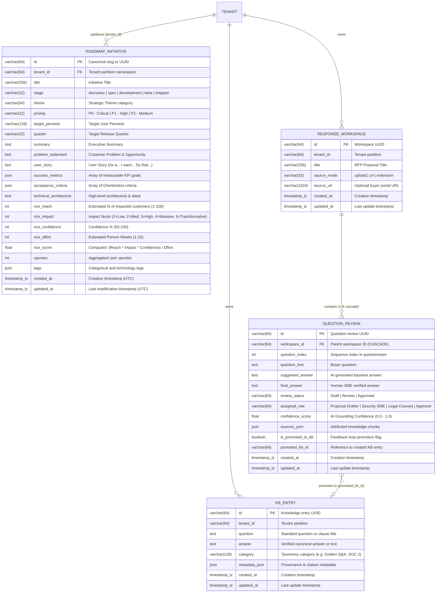
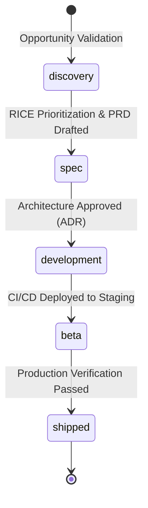

# Database Schema & Entity Relationships: Product Roadmap & Discovery Backlog

* **Target Database**: PostgreSQL 15+ (Neon Cloud / Local Docker)
* **ORM Engine**: SQLAlchemy 2.0 Async (`asyncpg`)
* **Primary Table**: `roadmap_initiatives`
* **Related Tables**: `response_workspaces`, `question_reviews`, `kb_entries`

---

## 1. Entity-Relationship Diagram (ERD)



---

## 2. Table Definition: `roadmap_initiatives`

### DDL Specification

```sql
CREATE TABLE IF NOT EXISTS roadmap_initiatives (
    id VARCHAR(64) PRIMARY KEY,
    tenant_id VARCHAR(64) NOT NULL DEFAULT 'default',
    title VARCHAR(256) NOT NULL,
    stage VARCHAR(32) NOT NULL DEFAULT 'discovery',
    theme VARCHAR(64) NOT NULL DEFAULT 'Core AI & Retrieval',
    priority VARCHAR(32) NOT NULL DEFAULT 'P1 - High',
    target_persona VARCHAR(128) NOT NULL DEFAULT 'Proposal Manager',
    quarter VARCHAR(32) NOT NULL DEFAULT 'In Discovery',
    summary TEXT NOT NULL DEFAULT '',
    problem_statement TEXT NOT NULL DEFAULT '',
    user_story TEXT NOT NULL DEFAULT '',
    success_metrics JSON NOT NULL DEFAULT '[]'::json,
    acceptance_criteria JSON NOT NULL DEFAULT '[]'::json,
    technical_architecture TEXT NOT NULL DEFAULT '',
    rice_reach INTEGER NOT NULL DEFAULT 50,
    rice_impact INTEGER NOT NULL DEFAULT 3,
    rice_confidence INTEGER NOT NULL DEFAULT 80,
    rice_effort INTEGER NOT NULL DEFAULT 3,
    rice_score DOUBLE PRECISION NOT NULL DEFAULT 40.0,
    upvotes INTEGER NOT NULL DEFAULT 0,
    tags JSON NOT NULL DEFAULT '[]'::json,
    created_at TIMESTAMP WITH TIME ZONE NOT NULL DEFAULT (NOW() AT TIME ZONE 'utc'),
    updated_at TIMESTAMP WITH TIME ZONE NOT NULL DEFAULT (NOW() AT TIME ZONE 'utc')
);

-- Composite index for fast tenant-scoped stage queries & Kanban rendering
CREATE INDEX IF NOT EXISTS ix_roadmap_tenant_stage 
    ON roadmap_initiatives (tenant_id, stage);
```

---

## 3. Column Data Dictionary

| Column | Type | Nullable | Default | Description |
| :--- | :--- | :---: | :--- | :--- |
| `id` | `VARCHAR(64)` | ❌ | *PK* | Unique slug (e.g. `gcip-multi-tenant-auth-and-google-signin`) or UUID. |
| `tenant_id` | `VARCHAR(64)` | ❌ | `'default'` | Multi-tenant namespace partition key. |
| `title` | `VARCHAR(256)` | ❌ | — | Feature name displayed on Kanban cards. |
| `stage` | `VARCHAR(32)` | ❌ | `'discovery'` | Kanban column: `discovery`, `spec`, `development`, `beta`, `shipped`. |
| `theme` | `VARCHAR(64)` | ❌ | `'Core AI & Retrieval'` | Strategic pillar (e.g. `Enterprise Governance`, `Smart Ingestion`). |
| `priority` | `VARCHAR(32)` | ❌ | `'P1 - High'` | Execution urgency: `P0 - Critical`, `P1 - High`, `P2 - Medium`. |
| `target_persona` | `VARCHAR(128)` | ❌ | `'Proposal Manager'` | Primary beneficiary (e.g. `Security SME`, `Legal Counsel`, `Evaluator`). |
| `quarter` | `VARCHAR(32)` | ❌ | `'In Discovery'` | Target delivery milestone (e.g. `Q1 2026`, `Q2 2026`, `H2 2026`, `Shipped`). |
| `summary` | `TEXT` | ❌ | `''` | High-level 2-line executive description. |
| `problem_statement` | `TEXT` | ❌ | `''` | Documented customer pain point and market validation. |
| `user_story` | `TEXT` | ❌ | `''` | Standard Agile user story framing. |
| `success_metrics` | `JSON` | ❌ | `'[]'` | JSON array of quantitative KPI criteria. |
| `acceptance_criteria`| `JSON` | ❌ | `'[]'` | JSON array of Gherkin acceptance scenarios. |
| `technical_architecture`| `TEXT` | ❌ | `''` | System design, database components, and AI service stack. |
| `rice_reach` | `INTEGER` | ❌ | `50` | Audience reach estimation (0–100%). |
| `rice_impact` | `INTEGER` | ❌ | `3` | Impact weight (1=Minimal to 5=Transformative). |
| `rice_confidence` | `INTEGER` | ❌ | `80` | Statistical confidence factor (50–100%). |
| `rice_effort` | `INTEGER` | ❌ | `3` | Engineering complexity in person-weeks (1–10). |
| `rice_score` | `FLOAT` | ❌ | `40.0` | Computed RICE priority score. |
| `upvotes` | `INTEGER` | ❌ | `0` | Live crowd-sourced voter tally. |
| `tags` | `JSON` | ❌ | `'[]'` | Searchable keyword chips and technology labels. |
| `created_at` | `TIMESTAMPTZ`| ❌ | `NOW()` | Record creation timestamp. |
| `updated_at` | `TIMESTAMPTZ`| ❌ | `NOW()` | Auto-updated modification timestamp. |

---

## 4. Business Logic & Constraints

### 1. RICE Score Computation
Whenever an initiative is created or updated, the `rice_score` is deterministically computed as:
$$\text{RICE Score} = \frac{\text{rice\_reach} \times \text{rice\_impact} \times \text{rice\_confidence}}{\text{rice\_effort}}$$

*Example*: $\text{Reach: } 95\% \times \text{Impact: } 5 \times \text{Confidence: } 90\% \div \text{Effort: } 3 = \mathbf{142.5}$

### 2. Multi-Tenant Partitioning
* Every query on `roadmap_initiatives` MUST filter on `tenant_id` (`WHERE tenant_id = :tenant_id`).
* The composite B-Tree index `(tenant_id, stage)` ensures $O(\log N)$ query performance when rendering filtered Kanban views.

### 3. Stage State Transitions

