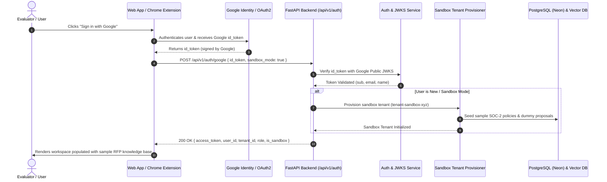

# Design Document: Frictionless Google Sign-In & Instant Sandbox Tenant Provisioning

- **Feature**: Basic Google Sign-In & Instant Sandbox Tenant Provisioning (Task 7.1)
- **Status**: Work In Progress (WIP)
- **Date**: 2026-09-01
- **Related ADR**: [ADR 0021: Multi-Tenant B2B Authentication Architecture](../adr/0021-multi-tenant-authentication-with-google-cloud-identity-and-sso.md)

---

## 1. Problem Statement & Goals

### The Challenge
To evaluate **RFPEngine**, prospective users and evaluators currently require pre-configured test credentials and an existing tenant context. For enterprise sales trials and product evaluations, evaluators expect an **instant, 1-click onboarding experience** without configuring SAML metadata or corporate SSO.

### Objectives
1. **1-Click Google Sign-In**: Allow any evaluator with a Google account to authenticate via Google OAuth2 / OIDC.
2. **Automatic Sandbox Provisioning**: If a user is new or in evaluation mode, automatically create a dedicated sandbox tenant (`tenant-sandbox-<uuid>`).
3. **Pre-Seeded Knowledge Base**: Automatically seed the evaluation tenant with realistic compliance documents (e.g. SOC 2 Type II Security Whitepaper, Encryption Policy) so the user can immediately test hybrid retrieval and AI drafting.
4. **Seamless Chrome Extension & Web App Token Flow**: Issue standard, secure JWT tokens compatible with both the Web Application and Chrome Browser Extension.

---

## 2. System Architecture & Sequence Flow



---

## 3. API Specification

### `POST /api/v1/auth/google`

#### Request Payload
```json
{
  "id_token": "eyJhbGciOiJSUzI1NiIsImtpZCI6...",
  "sandbox_mode": true
}
```

#### Response Payload (`200 OK`)
```json
{
  "access_token": "eyJhbGciOiJIUzI1NiIsInR5cCI6...",
  "token_type": "bearer",
  "user_id": "google_1092837461928374",
  "email": "evaluator@gmail.com",
  "name": "Jane Evaluator",
  "tenant_id": "tenant-sandbox-4f9a12c8",
  "role": "admin",
  "is_sandbox_tenant": true,
  "expires_in": 86400
}
```

#### Error Response (`401 Unauthorized`)
```json
{
  "detail": "Invalid Google token signature or expired timestamp"
}
```

---

## 4. Backend Implementation Plan

### Component 1: Google Token Verifier (`backend/app/core/auth.py`)
- Fetches and caches Google's public JSON Web Key Set (`https://www.googleapis.com/oauth2/v3/certs`).
- Validates:
  1. Cryptographic RSA signature (`RS256`).
  2. Audience (`aud` matches configured `GOOGLE_CLIENT_ID`).
  3. Issuer (`iss` is `https://accounts.google.com` or `accounts.google.com`).
  4. Expiration (`exp > now()`).

### Component 2: Sandbox Tenant Provisioner (`backend/app/services/tenant_provisioner.py`)
- Generates unique tenant identifier: `tenant-sandbox-<uuid4>[:8]`.
- Inserts pre-seeded knowledge documents into PostgreSQL and Hybrid Search index:
  1. *Acme Security & Encryption Architecture Whitepaper (AES-256, TLS 1.3, SOC 2)*.
  2. *Data Retention & GDPR Article 28 Compliance Schedule*.
  3. *Cloud Infrastructure Disaster Recovery Plan (RTO < 4h, RPO < 15m)*.
- Seeds 1 sample buyer questionnaire proposal with 3 draft questions ready for review.

### Component 3: Authentication Router (`backend/app/api/v1/endpoints/auth.py`)
- `POST /api/v1/auth/google`: Handles Google token validation and session creation.
- `GET /api/v1/auth/me`: Returns current user identity, role, and active tenant status.
- `POST /api/v1/auth/guest-sandbox`: One-click instant guest login without any credentials.

---

## 5. Security & Isolation Considerations

1. **Tenant Sandboxing**: Sandbox tenants are isolated using the standard `tenant_id` database filter and Pinecone/Algolia namespace boundaries.
2. **Sandbox Tenant Lifecycle**: Sandbox tenants are tagged with `is_sandbox=True` and scheduled for automatic cleanup after 14 days of inactivity.
3. **Role Enforcement**: Google Sign-in users receive `admin` role within their own isolated sandbox tenant, allowing them to test reviewer approval workflows, SME assignment, and document uploads.

---

## 6. Verification & Automated Test Matrix

| Test Case | Description | Expected Outcome |
| :--- | :--- | :--- |
| `test_google_token_verification_success` | Verifies valid Google token and claims extraction. | HTTP 200 with JWT & tenant context. |
| `test_google_token_expired` | Submits expired Google token. | HTTP 401 Unauthorized. |
| `test_sandbox_tenant_auto_seeding` | Verifies new evaluation user receives pre-seeded documents. | Sandbox tenant populated with 3 sample documents. |
| `test_sandbox_tenant_search_isolation` | Verifies queries in sandbox tenant cannot access other tenants. | Multi-tenant isolation verified (0 cross-tenant leaks). |

