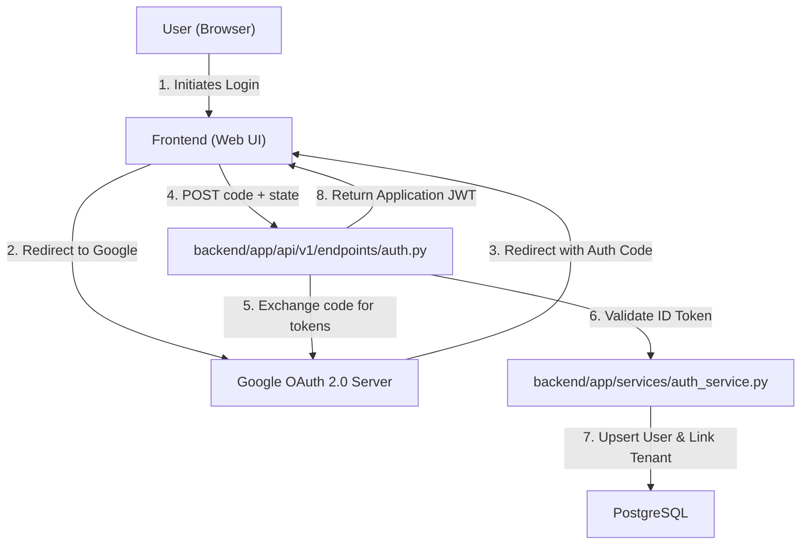

```markdown:docs/design/DESIGN-11.md
# Technical Design: implement google sign in

## 1. Overview & Context
- **Issue**: #11
- **Core Problem**: Users currently rely on manual email/password authentication, which increases friction during onboarding and presents security management overhead. There is a requirement for a seamless Single Sign-On (SSO) experience via Google.
- **Proposed Solution**: Implement the OAuth2 Authorization Code Flow. The backend will act as the Relying Party (RP), exchanging authorization codes received from the frontend for Google ID tokens, validating those tokens, and managing user session creation/upsertion within the existing multi-tenant architecture.

## 2. Architecture & Component Interaction


## 3. File Impact Matrix
| Action | File Path | Description |
| :--- | :--- | :--- |
| `[NEW]` | `backend/app/services/auth_service.py` | Logic for Google token exchange, ID token validation, and user upsertion. |
| `[NEW]` | `backend/app/api/v1/endpoints/auth.py` | REST endpoints for `/auth/google/callback` and `/auth/logout`. |
| `[MODIFY]` | `backend/app/models/user.py` | Add `google_id` (unique) and `auth_provider` fields to the User model. |
| `[NEW]` | `backend/tests/test_auth_service.py` | Unit tests for token validation and user mapping using mocked Google responses. |
| `[NEW]` | `backend/tests/test_auth_endpoints.py` | Integration tests for the OAuth callback flow. |

## 4. Data Models & API Contracts
- **Pydantic Models**:
    - `GoogleCallbackRequest`: `{ "code": str, "state": str }`
    - `AuthTokenResponse`: `{ "access_token": str, "token_type": "bearer", "expires_in": int }`
- **Database Changes**:
    - `users` table:
        - `google_id`: `String(255)`, Unique, Nullable (to support legacy email/pass).
        - `auth_provider`: `String(50)`, Default 'local'.

## 5. Security, Invariants & Multi-Tenancy
- **Tenant Isolation**: 
    - During the callback, the `X-Tenant-ID` header must be provided or inferred from the request context to ensure the Google user is associated with the correct tenant workspace.
    - If a user exists in a different tenant, the system must prevent cross-tenant authentication via strict `tenant_id` filtering in the `upsert` logic.
- **Defensive Safeguards**:
    - **CSRF Protection**: Mandatory validation of the `state` parameter passed from the frontend to the backend.
    - **Token Validation**: Strict verification of `iss` (accounts.google.com), `aud` (our Client ID), and `exp` (expiration) using `google-auth` library.
    - **Credential Sanitization**: Ensure no raw Google tokens are logged or stored in the database; only the validated `sub` (subject) and `email` are persisted.

## 6. Verification & Test Strategy
- **Unit tests**: `backend/tests/test_auth_service.py`
    - Mock `google.oauth2.id_token.verify_oauth2_token` to simulate valid, expired, and malformed tokens.
    - Test user upsert logic (new user vs. existing user with different email).
- **Integration tests**: `backend/tests/test_auth_endpoints.py`
    - Simulate the full callback flow from the API layer down to the DB.
- **Regression verification**: Ensure existing JWT-based authentication for local users remains unaffected.
```