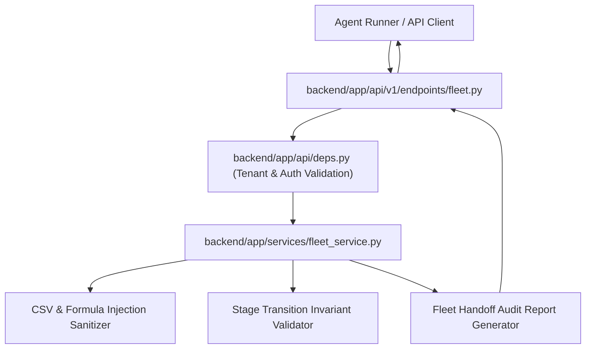

# Technical Design: Verify autonomous Agentic Fleet handoff to final approval

## 1. Overview & Context
- **Issue**: #15
- **Core Problem**: Autonomous Agentic Fleet execution requires end-to-end operational verification across all SDLC stages (spec, design, implementation, security audit, and QA verification) before halting at the final human merge gate. To validate this pipeline live within the FastAPI backend workspace, an autonomous fleet handoff verification mechanism is required to validate stage transitions, enforce multi-tenant pipeline audit state, and verify fleet handoff telemetry integrity.
- **Proposed Solution**: Implement a dedicated `FleetHandoffService` and REST endpoint (`/api/v1/fleet/handoff/verify`) in the backend. The service validates autonomous stage lifecycle transitions, enforces multi-tenant boundary checks via `X-Tenant-ID`, validates handoff payload invariants, sanitizes telemetry audit outputs against formula injection / path traversal, and produces deterministic verification reports.

## 2. Architecture & Component Interaction


## 3. File Impact Matrix
| Action | File Path | Description |
| :--- | :--- | :--- |
| `[NEW]` | `backend/app/schemas/fleet.py` | Pydantic schemas for stage definitions, handoff requests, and verification results |
| `[NEW]` | `backend/app/services/fleet_service.py` | Core business logic for stage verification, transition sequencing, and telemetry sanitization |
| `[NEW]` | `backend/app/api/v1/endpoints/fleet.py` | FastAPI endpoint `/api/v1/fleet/handoff/verify` handling POST/GET verification runs |
| `[MODIFY]` | `backend/app/api/v1/router.py` | Registers the fleet handoff router into the v1 API prefix |
| `[NEW]` | `backend/tests/test_fleet_handoff.py` | Unit & integration tests for stage handoff validation, error handling, tenant isolation, and sanitization |

## 4. Data Models & API Contracts

### Pydantic Schemas (`backend/app/schemas/fleet.py`)
```python
from enum import Enum
from typing import Any, Dict, List, Optional
from pydantic import BaseModel, Field

class FleetStage(str, Enum):
    SPEC = "spec"
    DESIGN = "design"
    DEVELOPMENT = "development"
    SECURITY_AUDIT = "security_audit"
    QA_VERIFICATION = "qa_verification"
    FINAL_APPROVAL_GATE = "final_approval_gate"

class StageExecutionStatus(str, Enum):
    PENDING = "pending"
    IN_PROGRESS = "in_progress"
    COMPLETED = "completed"
    FAILED = "failed"
    REMEDIATED = "remediated"

class StageRecord(BaseModel):
    stage: FleetStage
    status: StageExecutionStatus
    agent_id: str = Field(..., min_length=1, max_length=128)
    details: Optional[Dict[str, Any]] = None
    remediation_attempts: int = Field(default=0, ge=0)

class FleetHandoffVerifyRequest(BaseModel):
    issue_id: int = Field(..., gt=0)
    session_id: str = Field(..., min_length=1, max_length=128)
    stages: List[StageRecord] = Field(..., min_items=1)
    notes: Optional[str] = Field(default=None, max_length=1000)

class FleetHandoffVerifyResponse(BaseModel):
    issue_id: int
    session_id: str
    tenant_id: str
    is_valid: bool
    current_stage: FleetStage
    ready_for_human_approval: bool
    remediation_count: int
    stage_breakdown: Dict[str, str]
    audit_summary: str
```

### API Contract
- **POST** `/api/v1/fleet/handoff/verify`
  - **Headers**: `X-Tenant-ID: str` (Required)
  - **Status Code 200**: Verification report generated successfully.
  - **Status Code 400**: Malformed stages, broken transition sequencing, or unhandled failures.
  - **Status Code 422**: Validation errors on required fields.

## 5. Security, Invariants & Multi-Tenancy
- **Tenant Isolation**: Strict enforcement of `X-Tenant-ID` header. Requests missing `X-Tenant-ID` or containing invalid characters are rejected (`HTTP 400 / 422`).
- **Sequential Invariants**: Fleet stages must adhere to the ordered progression: `spec` -> `design` -> `development` -> `security_audit` -> `qa_verification` -> `final_approval_gate`. Progression cannot jump forward without prior stages being `completed` or `remediated`.
- **In-flight Remediation Requirement**: If any stage status is `failed` without subsequent `remediated` or `completed` record, `ready_for_human_approval` MUST evaluate to `False`.
- **Defensive String Sanitization**: All audit notes, session IDs, and summary strings are strictly sanitized to prevent CSV formula injection (`=`, `+`, `-`, `@`, `\t`, `\r`) and path traversal sequences.

## 6. Verification & Test Strategy
- **Unit Tests (`backend/tests/test_fleet_handoff.py`)**:
  - Test valid full lifecycle from `spec` to `final_approval_gate` with `ready_for_human_approval=True`.
  - Test out-of-order stage sequencing rejection.
  - Test in-flight failure followed by successful remediation handling.
  - Test terminal failure preventing human approval gate transition.
  - Test multi-tenant isolation and missing `X-Tenant-ID` rejection.
  - Test formula injection sanitization on audit notes and metadata.
- **Regression Verification**:
  - Execute full test suite via `pytest backend/tests/` to guarantee 100% pass rate without regressions.