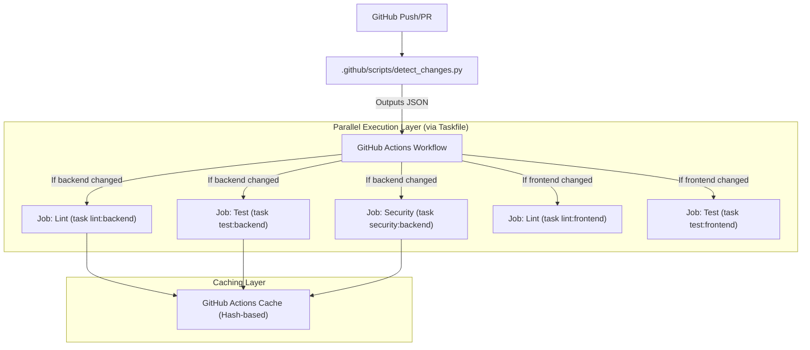

# Technical Design: improve the ci cd speed

## 1. Overview & Context
- **Issue**: #9
- **Core Problem**: The current CI/CD pipeline is monolithic and slow. Every change triggers a full suite of tests and scans across all modules (`backend`, `frontend`, `extension`), leading to long feedback loops and wasted compute resources.
- **Proposed Solution**: Implement a "Fast-Path" CI/CD architecture using three primary pillars:
    1. **Selective Execution**: A change-detection script that outputs a JSON manifest to trigger only affected modules.
    2. **Aggressive Dependency Caching**: Hash-based caching of environment dependencies to minimize installation time.
    3. **Parallelized Pipeline**: Decoupling linting, testing, and security scanning into parallel GitHub Action jobs to maximize throughput.

## 2. Architecture & Component Interaction



## 3. File Impact Matrix

| Action | File Path | Description |
| :--- | :--- | :--- |
| `[NEW]` | `.github/workflows/ci.yml` | Orchestrates the parallelized, selective CI pipeline. |
| `[NEW]` | `.github/scripts/detect_changes.py` | Logic to detect diffs and output a JSON change manifest. |
| `[MODIFY]` | `Taskfile.yml` | Adds/Updates commands for `lint`, `test`, and `security` to ensure CI/Local parity. |
| `[MODIFY]` | `.github/scripts/detect_changes.py` | (If existing) Refactor to output JSON instead of exit codes. |

## 4. Technical Specifications

### 4.1 Change Detection Contract (JSON Interface)
To avoid brittle shell parsing, `.github/scripts/detect_changes.py` will output a JSON object to a file (`change_manifest.json`). The GitHub Actions workflow will parse this file using `jq` or a dedicated step.

**Output Schema (`change_manifest.json`):**
```json
{
  "backend": true,
  "frontend": false,
  "extension": true,
  "docs": true
}
```

### 4.2 Cache Key Strategy
To prevent "poisoned cache" scenarios, cache keys will be strictly derived from the hashes of the dependency lock files.

**Key Patterns:**
- **Backend**: `cache-backend-${{ runner.os }}-${{ hashFiles('backend/requirements.txt') }}`
- **Frontend**: `cache-frontend-${{ runner.os }}-${{ hashFiles('frontend/package-lock.json') }}`

### 4.3 Security Scanning Placement
Security scanning (`safety` for Python, `npm audit` for JS) will be moved out of the "Linting" stage. It will run as a **parallel job** alongside the test suite. This ensures that a slow security scan does not block the immediate feedback provided by linting and unit tests.

### 4.4 Taskfile/CI Parity
The CI workflow is strictly forbidden from calling raw CLI tools (e.g., `pytest`, `eslint`). It must invoke the `Taskfile` to ensure that the environment used in CI is identical to the developer's local environment.

**Example CI Command:**
```yaml
run: task test:backend
```

## 5. Security, Invariants & Multi-Tenancy
- **Security**: Security scanning is decoupled to ensure high-speed feedback while maintaining rigorous vulnerability checks.
- **Invariants**: The `detect_changes.py` script must default to `true` for all modules if the diff is ambiguous (e.g., changes to root configuration files like `Taskfile.yml`) to prevent skipping critical tests.

## 6. Verification & Test Strategy
- **Unit Test for Change Detection**: A test suite within `.github/scripts/` to verify that `detect_changes.py` correctly identifies changes in specific directories and produces the correct JSON schema.
- **Dry Run**: Execute the new `Taskfile` commands locally to ensure they match the expected CI behavior.
- **Workflow Simulation**: Use `act` or manual triggers to verify that the parallel jobs trigger correctly based on the JSON manifest.