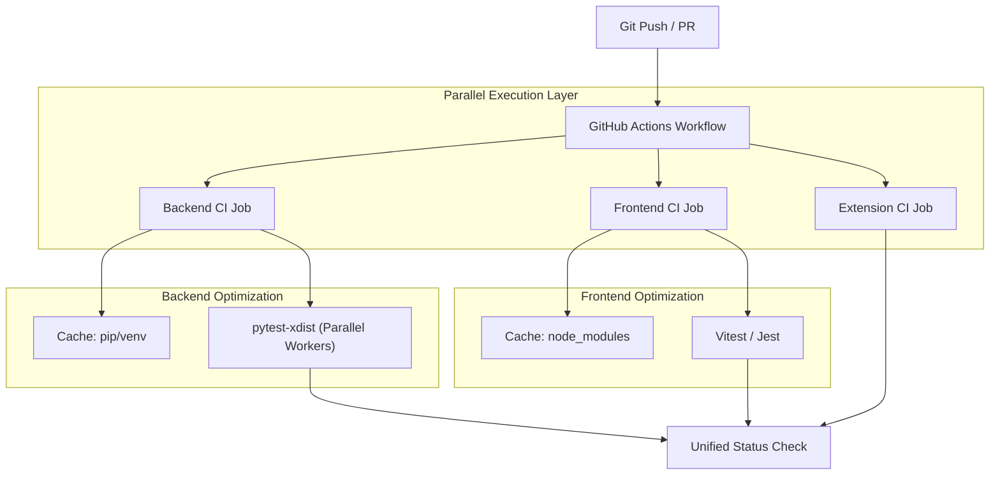

Since the request is to "Implement specification for Issue #9" and the current stage is the transition from `spec` to `design`, I am initiating **Phase 1: Technical Design**.

Below is the structured Technical Design Document for improving the CI/CD speed.

***

# Technical Design: improve the ci cd speed

## 1. Overview & Context
- **Issue**: #9
- **Core Problem**: The current CI/CD pipeline is monolithic and sequential. As the monorepo grows (backend, frontend, extension), the time to validate a Pull Request increases linearly, causing developer friction and slow feedback loops.
- **Proposed Solution**: Implement a multi-layered optimization strategy:
    1. **Job Parallelization**: Split the monolithic CI workflow into concurrent jobs (Backend, Frontend, Extension).
    2. **Test Parallelization**: Utilize `pytest-xdist` within the backend job to distribute tests across CPU cores.
    3. **Dependency Caching**: Implement aggressive caching for `pip` (backend) and `npm/yarn` (frontend/extension) using GitHub Actions cache actions.
    4. **Path-Based Execution**: Use `on.push.paths` and `on.pull_request.paths` to ensure only modified modules trigger their respective test suites.

## 2. Architecture & Component Interaction

## 3. File Impact Matrix

| Action | File Path | Description |
| :--- | :--- | :--- |
| `[NEW]` | `.github/workflows/ci.yml` | Orchestrates parallel jobs and path-based triggers. |
| `[MODIFY]` | `backend/requirements.txt` | Add `pytest-xdist` for parallel test execution. |
| `[MODIFY]` | `Taskfile.yml` | Update local task commands to support parallel testing flags. |
| `[MODIFY]` | `backend/pytest.ini` | Configure default test execution patterns. |

## 4. Data Models & API Contracts
*N/A - This is an infrastructure/DevOps improvement.*

## 5. Security, Invariants & Multi-Tenancy
- **Test Isolation**: When running `pytest-xdist`, ensure that database-dependent tests use unique schema names or database identifiers per worker to prevent race conditions (e.g., `test_db_{worker_id}`).
- **Secret Management**: Ensure CI caching does not inadvertently cache sensitive `.env` files or credentials. Use `actions/cache` with strict path scoping.

## 6. Verification & Test Strategy

### Gherkin Scenarios

**Scenario 1: Path-based triggering**
- **Given** a developer makes a change only to `backend/app/services/csv_service.py`
- **When** the Pull Request is opened
- **Then** the `Backend CI Job` should trigger
- **And** the `Frontend CI Job` and `Extension CI Job` should be skipped.

**Scenario 2: Parallel Test Execution**
- **Given** the backend test suite contains 100+ unit tests
- **When** the `Backend CI Job` runs
- **Then** the total execution time should be significantly lower than sequential execution (target: < 3 minutes).

**Scenario 3: Dependency Caching**
- **Given** a CI run where `backend/requirements.txt` has not changed
- **When** the `Install Dependencies` step runs
- **Then** the step should report "Cache restored" and skip the `pip install` download phase.

### Verification Steps
1. **Baseline Measurement**: Run current CI and record total duration.
2. **Implementation**: Apply the workflow changes and dependency updates.
3. **Validation**: Run CI on a dummy PR and verify:
    - Jobs run in parallel (check GitHub Actions UI).
    - Cache hits are recorded in logs.
    - `pytest-xdist` workers are active.
4. **Regression**: Ensure all 67+ existing backend tests pass under parallel execution.